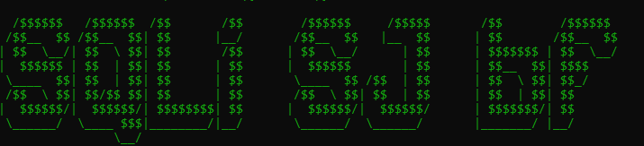
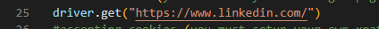
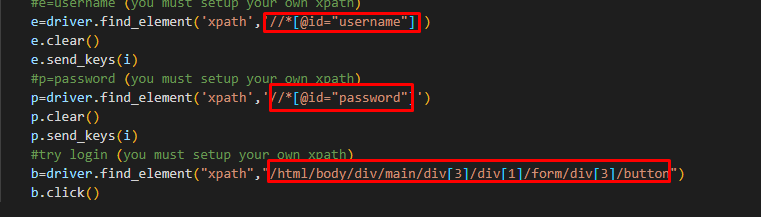
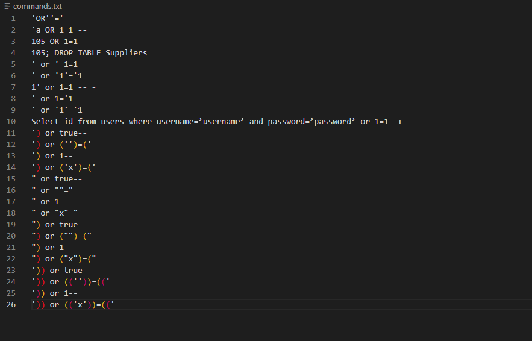

<h1>SQLi SJ bf</h1>

This is a program written in python which allows you to automate sql injection in login panels.

It is created to work in linkedin. However, you are the one who has to adapt it to the target website.

<h2>Setting it up</h2>

<b>1. Set your path locations</b>

In lines 20 and 22 enter respectively the location of the firefox browser and geckodriver (you must install geckodriver)

<b>2. Set your target website</b>

In line 25 enter the login page or pages with forms that may be vulnerable to sqli

<b>3. Set your target xpaths</b>

In lines 34, 38 and 42 enter respectively the xpath of the username, password and login button fields

<b>4. Set yours sql injection payloads</b>

In lines 34, 38 and 42 enter respectively the xpath of the username, password and login button fields

<h2>Initializing the program</h2>

1. Open your CMD or Terminal

2. "git clone https://github.com/socialjack010/sql_injection_bruteforce_login.git"

3. "cd sql_injection_bruteforce_login"

4. "pip install -r -requirements.txt"

5. "python ss.py"

https://user-images.githubusercontent.com/125494686/221045087-d925f11b-3966-4608-8cc9-ee4a561ed4bd.mp4

<a href='https://www.instagram.com/socialjack010/'>Instagram></a>
<a href='https://www.tiktok.com/@socialjackinfo'>TikTok></a>
<a href='https://discord.gg/ybzs9qRQc4/'>Discord></a>
